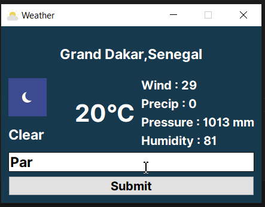

<h1 align="center">
<br/>
weather-gui
</h1>
<p align="center"><b>weather-gui</b> is a graphical user interface build with python and PyQT5.<br>We can find out the weather anywhere in the world, in any country or city, thanks to API requests from <a href="https://weatherstack.com/">weatherstack.com</a>.<br> By default, weather-gui will display the temperature in the country we are in.<br> We can search for any country whose temperature we'd like to know.</p>

<p align="center"><a href="https://www.python.org/" target="_blank"></a>&nbsp;<a href="http://perso.crans.org/besson/LICENSE.html" target="_blank"></a>&nbsp;<a href="https://pypi.org/project/PyQt5/" target="_blank"></a>&nbsp;<a href="https://github.com/ANSELME-TIC" target="_blank"></a>&nbsp;</p>

<br>

## 🔨 Dependencies
#### The list of libraries and their respective versions are listed in the file [requirements.txt](requirements.txt).
#### To install all dependencies you can use the following command:
```bash
pip install -r requirements.txt
```
Make sure you have [pip](https://pypi.org/project/pip/) and [Python3.8 or above version](https://www.python.org/) installed on your computer.

## :construction: Working Project
<p align="center"> Watch the demo here :point_down:</p>
<p align="center">&nbsp;</p>

## How to Use :question:

### :arrow_forward: Steps to Run the project
1. Clone the repository in your machine.
2. Open a terminal in the repository root folder.
3. Install all the dependencies for the project from the requirements.txt file by using the command. 
```bash
pip install -r requirements.txt
```
4. Run the application.
5. To run the application, run the following command in the terminal:
```bash
python weather-gui.py
```

## 🚀 Technologies
#### All the code was built in [Python3](https://www.python.org/). With a blend of my first experience with the library [PyQt5](https://pypi.org/project/PyQt5/).

<br>

## :books: Supporting Modules
- QtGUI
- QtCore
- QtWidgets
- Requests
- Pillow
